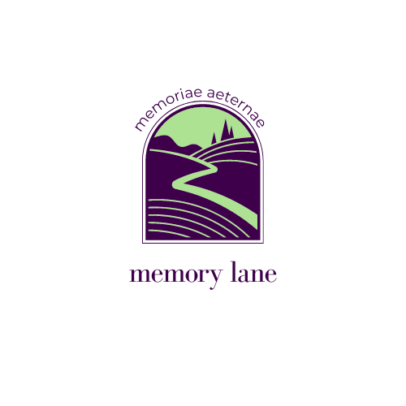

<!--
*** Thanks for checking out the Best-README-Template. If you have a suggestion
*** that would make this better, please fork the repo and create a pull request
*** or simply open an issue with the tag "enhancement".
*** Don't forget to give the project a star!
*** Thanks again! Now go create something AMAZING! :D
-->

<!-- PROJECT SHIELDS -->
<!--
*** I'm using markdown "reference style" links for readability.
*** Reference links are enclosed in brackets [ ] instead of parentheses ( ).
*** See the bottom of this document for the declaration of the reference variables
*** for contributors-url, forks-url, etc. This is an optional, concise syntax you may use.
*** https://www.markdownguide.org/basic-syntax/#reference-style-links
-->
[![LinkedIn][linkedin-shield]][linkedin-url]

<!-- PROJECT LOGO -->
 

  

<h3 align="center">Memory Lane</h3>

  

    Memory Lane is a Occulus App that allows the user to memorize speeches though the use of visual focus points along a path.
     
    <a href="https://github.com/CSant04y/Memory_Lane_Webpage"><strong>Explore the docs »</strong></a>
     
     
    <a href="https://github.com/CSant04y/Memory_Lane_Webpage">View Demo</a>
    ·
    <a href="https://github.com/CSant04y/Memory_Lane_Webpage/issues">Report Bug</a>
    ·
    <a href="https://github.com/CSant04y/Memory_Lane_Webpage/issues">Request Feature</a>
  

<!-- TABLE OF CONTENTS -->
<!-- 

  
Table of Contents

  <ol>
    <li>
      <a href="#about-the-project">About The Project</a>
      <ul>
        <li><a href="#built-with">Built With</a></li>
      </ul>
    </li>
    <li>
      <a href="#getting-started">Getting Started</a>
      <ul>
        <li><a href="#prerequisites">Prerequisites</a></li>
        <li><a href="#installation">Installation</a></li>
      </ul>
    </li>
    <li><a href="#usage">Usage</a></li>
    <li><a href="#roadmap">Roadmap</a></li>
    <li><a href="#contributing">Contributing</a></li>
    <li><a href="#license">License</a></li>
    <li><a href="#contact">Contact</a></li>
    <li><a href="#acknowledgments">Acknowledgments</a></li>
  </ol>

 -->

<!-- ABOUT THE PROJECT -->
## About The Project

[![Product Name Screen Shot][product-screenshot]](https://example.com)

Here's a blank template to get started: To avoid retyping too much info. Do a search and replace with your text editor for the following: `CSant04y`, `Memory_Lane_Webpage`, `twitter_handle`, `linkedin_username`, `email_client`, `email`, `project_title`, `project_description`

(<a href="#top">back to top</a>)

### Built With

* [Webpack](https://webpack.js.org/)
* [React.js](https://reactjs.org/)
* [Tailwind](https://tailwindcss.com/)

(<a href="#top">back to top</a>)

<!-- CONTACT -->
## Contact

Your Name - [@esquivelcarlo12](https://twitter.com/esquivelcarlo12) - esquivelcarlos27893@gmail.com

Project Link: [https://github.com/github_username/Memory_Lane_Webpage](https://github.com/CSant04y/Memory_Lane_Webpage)

(<a href="#top">back to top</a>)

<!-- ACKNOWLEDGMENTS -->
## Acknowledgments

* [DaisyUi](https://daisyui.com/)
* [Icons](https://icons8.com/)
* [StackBlitz](https://stackblitz.com/)

(<a href="#top">back to top</a>)

<!-- MARKDOWN LINKS & IMAGES -->
<!-- https://www.markdownguide.org/basic-syntax/#reference-style-links -->
[linkedin-shield]: https://img.shields.io/badge/-LinkedIn-black.svg?style=for-the-badge&logo=linkedin&colorB=555
[linkedin-url]: https://linkedin.com/in/linkedin_username
[product-screenshot]: images/screenshot.png